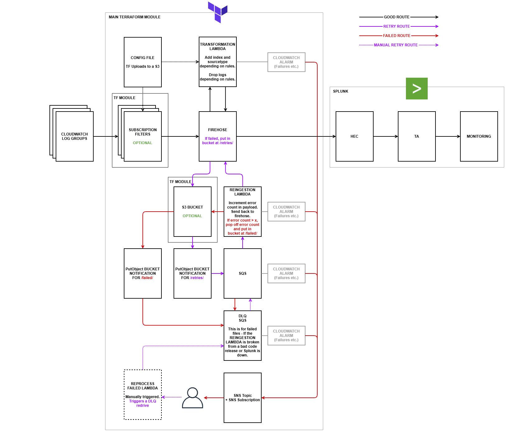

# Firehose to Splunk terraform
 
## What is this?
This repository contains a main module (and 2 little helper modules) that provide a tested blueprint for sending logs from AWS to firehose. You can send logs to this firehose from different AWS CloudWatch log groups, the firehose then uses a small lambda (python) that takes a config that lets you: 
1.	Redact or drop logs based on regex
2.	Apply indexes and sourcetypes based on source or regex

There are also 2 retry lambdas to cover the 2 failure senarios when using Firehose (See the Architecture section for more info)

## Why did we make it?
Past patterns we used for cloud native security log pipelines have required config/complexity elsewhere and using lots of different firehose instances to send logs without transformation (something we wanted to do) 

The other alternative requires increased effort to build, maintain and support of a cluster of Spunk Heavy forwarders or Edge processors. In our experience these require carful attention to scale correctly and are difficult to adapt for use with immutable infrastructure.

This project attempts to create a third option, where some minimal transformation of logs is required while still wanting to benefit from a cloud managed (and auto-scaled) service. 

## How do I use it?
Have a look at the ./example.tf file and ./untested_example_config.yaml for you can deploy and configure this module.
We recommended that you incorporate this module by linking to a tested release, that way you remain in a stable state while making it easy to update to newer versions. You can do that like so

```hcl
module "splunk_firehose" {
  source = "git@github.com:UKHomeOffice/firehose-splunk-tf-module.git?ref=0.0.1 "

  # other vars …
}
```

## Architecture


